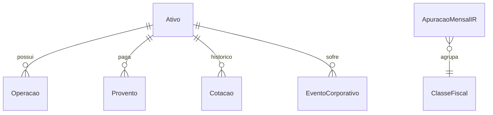
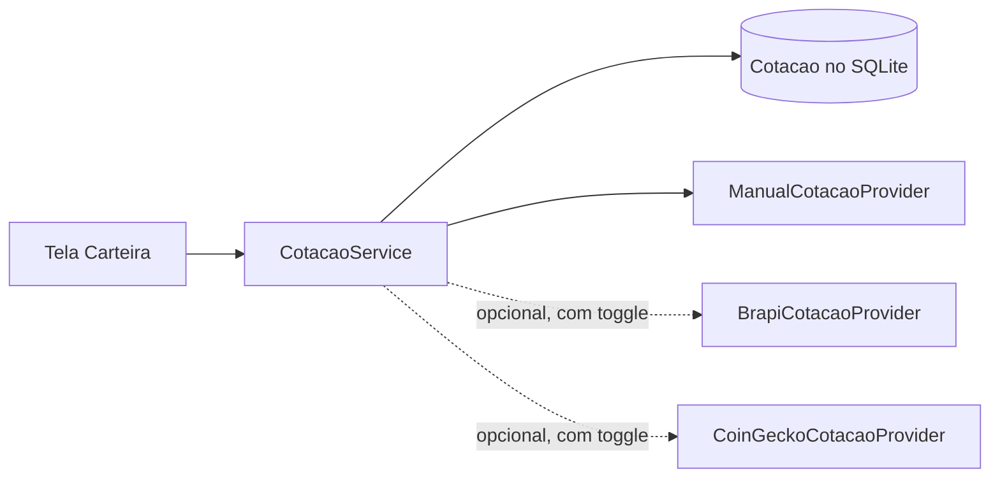

# Fase 2 — Módulo de Investimentos (Ações, ETFs, FIIs e Criptos)

> Status: **planejado, não implementado**. Este documento é o roteiro de execução da Fase 2.

## 1. Objetivo

Acompanhar a carteira de investimentos de renda variável da família dentro do Pro Orçamento, mantendo a premissa
**local-first** (tudo funciona offline, com SQLite) e integrando o resultado com o orçamento mensal
(aportes como despesa de investimento, proventos como receita).

Escopo inicial:

- Ações da B3, ETFs (nacionais e BDRs de ETF), FIIs e criptoativos.
- Registro de operações de compra e venda, proventos (dividendos, JCP, rendimentos de FII) e eventos (desdobramento, grupamento, bonificação).
- Posição consolidada, preço médio, resultado realizado e não realizado, rentabilidade e alocação.
- Apuração mensal de imposto de renda (relatório de DARF), com compensação de prejuízos.

Fora do escopo da Fase 2: renda fixa, opções, futuros, aluguel de ações e integração automática com corretoras (CEI/B3).

## 2. Modelo de dados (OrcaFacil.Core)

| Entidade | Campos principais |
|---|---|
| `Ativo` | Id, Ticker (único, NOCASE), Nome, Tipo (`Acao`, `Etf`, `Fii`, `Bdr`, `Cripto`), Moeda (`BRL`, `USD`), ClasseRisco (`Baixo`, `Medio`, `Alto`), Setor, Ativo (bool) |
| `Operacao` | Id, AtivoId, Tipo (`Compra`, `Venda`), Data, Quantidade (decimal(28,10) — cripto fracionado), PrecoUnitario, Taxas (corretagem + emolumentos), DayTrade (bool), Observacao, TransacaoId? (vínculo com o lançamento do orçamento) |
| `Provento` | Id, AtivoId, Tipo (`Dividendo`, `Jcp`, `Rendimento`, `Outro`), DataCom, DataPagamento, ValorBruto, IrRetido, TransacaoId? |
| `EventoCorporativo` | Id, AtivoId, Tipo (`Desdobramento`, `Grupamento`, `Bonificacao`), Data, Fator, CustoAtribuido? |
| `Cotacao` | Id, AtivoId, Data, Preco, Fonte (`Manual`, `Brapi`, `CoinGecko`), AtualizadoEm — índice único (AtivoId, Data) |
| `ApuracaoMensalIR` | Id, Mes, Ano, ClasseFiscal, TotalVendas, ResultadoLiquido, PrejuizoCompensado, PrejuizoAcumulado, ImpostoDevido, IrrfRetido, Pago (bool) |

Tudo em uma migração `AddInvestimentos`. Repositórios seguindo o padrão atual (`GenericRepository<T>` + interfaces em `Core/Repositories`).

## 3. Regras de cálculo

### 3.1 Preço médio ponderado

- Compra: `PM = (Qtd_atual × PM_atual + Qtd_compra × Preço + Taxas) / (Qtd_atual + Qtd_compra)`.
- Venda: não altera o PM; gera resultado realizado `= Qtd × (Preço − PM) − Taxas`.
- Eventos: desdobramento/grupamento ajustam quantidade e PM pelo fator (custo total inalterado); bonificação entra com o custo atribuído informado pela empresa.
- Day trade é apurado separadamente (compra e venda do mesmo ativo no mesmo dia) e não afeta o PM do swing trade.

### 3.2 Indicadores da carteira

- Posição: quantidade, PM, custo total, valor de mercado (última cotação), resultado não realizado (R$ e %).
- Rentabilidade simples e, numa segunda etapa, TIR (XIRR) considerando aportes e proventos.
- Yield on cost de proventos (12 meses).
- Alocação por tipo de ativo, por classe de risco e por setor; desvio em relação a uma alocação-alvo opcional.
- Concentração: alerta quando um único ativo passar de X% da carteira (configurável).

### 3.3 Imposto de renda (pessoa física, Brasil)

Implementar como **motor de regras isolado e testável** (`ApuracaoIrService`), com alíquotas e limites parametrizados
(as regras mudam com a legislação; manter os valores em uma tabela/arquivo de configuração, não espalhados no código).

| Classe fiscal | Alíquota | Isenção | Observações |
|---|---|---|---|
| Ações — swing trade | 15% | Vendas totais ≤ R$ 20.000 no mês | Isenção não vale para ETFs, FIIs e BDRs |
| Ações/ETFs — day trade | 20% | Nenhuma | IRRF 1% sobre o lucro, dedutível |
| ETFs de renda variável — swing | 15% | Nenhuma | |
| FIIs (ganho de capital) | 20% | Nenhuma | Rendimentos mensais podem ser isentos (verificar regras vigentes) |
| BDRs | 15% | Nenhuma | |
| Criptoativos | 15% (faixas progressivas acima de R$ 5 mi) | Alienações ≤ R$ 35.000 no mês | Regras específicas para exchanges no exterior |

- Prejuízos são compensados apenas dentro da mesma classe (swing com swing, day trade com day trade, FII com FII).
- IRRF ("dedo-duro") de 0,005% sobre vendas swing e 1% sobre day trade é deduzido do imposto devido.
- DARF código 6015, vencimento no último dia útil do mês seguinte; valores abaixo de R$ 10,00 acumulam para o mês seguinte.
- O app gera o **relatório de apuração** e pode criar automaticamente uma despesa "DARF" no orçamento do mês de vencimento.

> Aviso no app: os cálculos são estimativas para organização pessoal e não substituem a orientação de um contador.

## 4. Cotações (local-first)

- Interface `ICotacaoProvider { Task<IReadOnlyList<CotacaoDto>> ObterAsync(IEnumerable<string> tickers, CancellationToken ct); }`.
- **Padrão: `ManualCotacaoProvider`** — o usuário informa o preço atual (ou importa um CSV). O app continua 100% offline.
- Provedores online opcionais, desligados por padrão e habilitados em *Configurações > Investimentos*:
  - B3 (ações, ETFs, FIIs, BDRs): brapi.dev (token gratuito do usuário guardado em `SecureStorage`).
  - Cripto: CoinGecko API pública (cotação em BRL).
- Cache: última cotação por ativo/dia no SQLite; atualização manual (pull-to-refresh) ou ao abrir a tela, no máximo 1x a cada 15 minutos.
- Falha de rede nunca bloqueia a tela: mostra a última cotação conhecida com a data.

## 5. Interface (MudBlazor)

- Menu: novo item **Investimentos** (ícone `ShowChart`).
- **Carteira** (`/investimentos`): cabeçalho fixo com KPIs (patrimônio, custo, resultado, proventos 12m), donut de alocação, lista de posições; `FabMenu` com *Nova operação*, *Novo provento*, *Atualizar cotações*.
- **Ativo** (`/investimentos/ativo/{id}`): gráfico de linhas do valor da posição × custo, histórico de operações e proventos.
- **Operações** (`/investimentos/operacoes`): lista filtrável por período, ativo e tipo; formulário em dialog modal.
- **Imposto de renda** (`/investimentos/ir`): apuração mês a mês por classe, prejuízo acumulado, botão *Gerar despesa DARF*.
- **Dashboard**: card "Investimentos" com patrimônio e variação do mês.
- Respeitar o **fechamento de mês**: operações vinculadas a lançamentos seguem a mesma trava do período.

## 6. Integração com o orçamento

- Ao registrar uma compra, opção "Lançar como despesa" (categoria *Investimentos e Previdência*), criando a `Transacao` vinculada.
- Ao registrar um provento, opção "Lançar como receita" (categoria *Renda* ou nova *Proventos*).
- Na limpeza de dados (*Configurações > Armazenamento*), nova opção "Investimentos".

## 7. Plano de execução

1. Entidades, migração e repositórios + testes de repositório.
2. `PosicaoService` (preço médio, eventos corporativos, resultado) + testes unitários com cenários reais.
3. Telas Carteira, Operações e Ativo com `ManualCotacaoProvider`.
4. `ApuracaoIrService` + tela de IR + geração de despesa DARF.
5. Provedores online opcionais (brapi, CoinGecko) com toggle e cache.
6. Importação CSV de notas de corretagem/extratos (opcional).

## 8. Riscos e cuidados

- Precisão numérica: usar `decimal` em tudo; quantidades de cripto com até 10 casas.
- Legislação muda: alíquotas e limites parametrizados e cobertos por testes.
- Privacidade: nenhum dado de carteira sai do dispositivo; provedores online recebem apenas tickers.
- Desempenho: cálculo de posição incremental (cache por ativo invalidado a cada nova operação).
